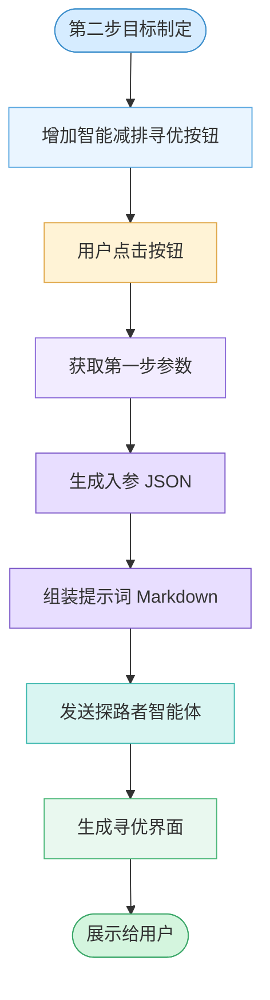

# 智能减排寻优 — 调用流程图

```mermaid
flowchart TD
    a1(["第二步目标制定"])
    a2["增加智能减排寻优按钮"]
    a3["用户点击按钮"]
    b1["获取第一步参数"]
    b2["生成入参 JSON"]
    b3["组装提示词 Markdown"]
    c1["发送探路者智能体"]
    c2["生成寻优界面"]
    c3(["展示给用户"])

    a1 --> a2 --> a3 --> b1 --> b2 --> b3 --> c1 --> c2 --> c3

    style a1 fill:#D6ECFF,stroke:#3D8FCC
    style a2 fill:#EAF5FF,stroke:#5BA8E0
    style a3 fill:#FFF3D6,stroke:#E0A84A
    style b1 fill:#F2ECFF,stroke:#8B6AD9
    style b2 fill:#E8DEFF,stroke:#7A55C7
    style b3 fill:#E8DEFF,stroke:#7A55C7
    style c1 fill:#D9F5F2,stroke:#3DB8AE
    style c2 fill:#E9F8EF,stroke:#4DB87A
    style c3 fill:#D4F5DE,stroke:#3DA86A
```
